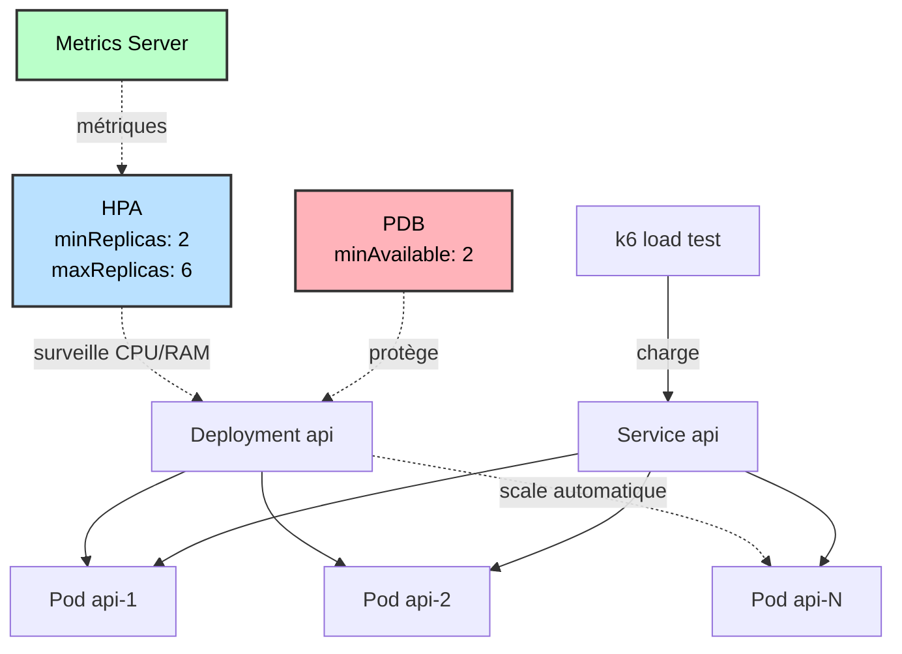

# TP S6 — Scalabilité & Résilience

Mise en œuvre de l'autoscaling (HPA), de la protection contre les disruptions (PDB), des SLO/SLI, et du déploiement canary avec Argo Rollouts.

## Description

- HorizontalPodAutoscaler (HPA) basé sur CPU et mémoire
- PodDisruptionBudget (PDB) pour maintenir la disponibilité
- Tests de charge avec k6
- Définition et mesure des SLO/SLI
- Déploiement canary avec Argo Rollouts (bonus)

## Architecture



## Prérequis

- Cluster Kubernetes avec metrics-server
- Applications déployées (front, api)
- k6 installé pour les tests de charge

## Déploiement rapide

```bash
./deploy-scaling.sh
```

Installe metrics-server (si nécessaire), HPA et PDB.

## Déploiement manuel

```bash
# Installer metrics-server (si nécessaire)
kubectl apply -f https://github.com/kubernetes-sigs/metrics-server/releases/latest/download/components.yaml

# Déployer HPA et PDB
kubectl apply -f manifests/scaling/api-hpa.yaml
kubectl apply -f manifests/scaling/front-hpa.yaml
kubectl apply -f manifests/scaling/api-pdb.yaml
kubectl apply -f manifests/scaling/front-pdb.yaml
```

## Tests

### Test HPA

```bash
./test-hpa.sh
```

Génère de la charge CPU et observe le scaling automatique.

### Test PDB

```bash
./test-pdb.sh
```

Tente de supprimer des pods et vérifie que PDB protège la disponibilité.

### Tests de charge k6

```bash
# Test API (50 req/s pendant 5min)
k6 run k6-tests/load-test-api.js

# Spike test (pic de charge)
k6 run k6-tests/spike-test.js
```

## Observer l'autoscaling

```bash
# Terminal 1: Lancer la charge
k6 run k6-tests/load-test-api.js

# Terminal 2: Observer HPA
watch -n 2 'kubectl get hpa,pods -n workshop'

# Terminal 3: Métriques
watch -n 5 'kubectl top pods -n workshop'
```

## Structure

### Manifests

- `manifests/scaling/api-hpa.yaml` - HPA pour l'API (2-6 replicas, 60% CPU)
- `manifests/scaling/api-pdb.yaml` - PDB API (minAvailable: 2)
- `manifests/scaling/api-rollout.yaml` - Argo Rollout canary (bonus)
- `manifests/scaling/api-services-canary.yaml` - Services pour canary

### Scripts

- `deploy-scaling.sh` - Déploiement HPA/PDB
- `test-hpa.sh` - Test autoscaling
- `test-pdb.sh` - Test disruption budget

### Tests de charge

- `k6-tests/load-test-api.js` - Test constant 50 req/s
- `k6-tests/spike-test.js` - Test pic de charge

### Documentation

- `SLO-SLI.md` - Définition SLO/SLI et résultats

## Concepts clés

### HPA

Autoscaling horizontal basé sur métriques :
- **CPU** : Utilisation moyenne CPU (%)
- **Mémoire** : Utilisation moyenne mémoire (%)
- **Custom** : Requêtes/sec via Prometheus Adapter (bonus)

Comportement : Scale up rapide, scale down progressif (stabilizationWindow).

### PDB

Protection contre les disruptions volontaires :
- **minAvailable** : Nombre minimum de pods toujours disponibles
- **maxUnavailable** : Nombre maximum de pods pouvant être indisponibles

Bloque les opérations qui violeraient le budget (drain node, évictions).

### QoS (Quality of Service)

Basé sur requests/limits :
- **Guaranteed** : requests = limits (priorité max)
- **Burstable** : requests < limits (priorité moyenne)
- **BestEffort** : pas de requests/limits (priorité min)

## SLO/SLI

Voir [SLO-SLI.md](SLO-SLI.md) pour :
- Définition des SLI (métriques)
- Objectifs SLO (cibles)
- Résultats des tests k6
- Error budget

## Déploiement canary (bonus)

### Installation Argo Rollouts

```bash
kubectl create namespace argo-rollouts
kubectl apply -n argo-rollouts -f https://github.com/argoproj/argo-rollouts/releases/latest/download/install.yaml
```

### Déployer le Rollout

```bash
kubectl apply -f manifests/scaling/api-services-canary.yaml
kubectl apply -f manifests/scaling/api-rollout.yaml
```

### Promouvoir une release canary

```bash
# Changer l'image
kubectl argo rollouts set image api api=kennethreitz/httpbin:latest -n workshop

# Observer la progression
kubectl argo rollouts get rollout api -n workshop --watch

# Promouvoir manuellement
kubectl argo rollouts promote api -n workshop
```

Stratégie : 10% → 30% → 60% → 100% avec pauses.

## Vérifications

```bash
# HPA
kubectl get hpa -n workshop
kubectl describe hpa api-hpa -n workshop

# PDB
kubectl get pdb -n workshop
kubectl describe pdb api-pdb -n workshop

# Métriques
kubectl top pods -n workshop
kubectl top nodes

# Événements
kubectl get events -n workshop --sort-by='.lastTimestamp' | tail -20
```

## Nettoyage

```bash
kubectl delete hpa,pdb -n workshop --all
```

## Livrables

- Fiche SLO/SLI avec résultats k6
- Manifests HPA + PDB
- Scripts de test
- Manifests Argo Rollouts (bonus)

## Évaluation (10 pts)

- HPA : 3 pts
- PDB : 2 pts
- SLO/SLI : 3 pts
- Tests de charge : 2 pts
- Bonus canary : +2 pts
