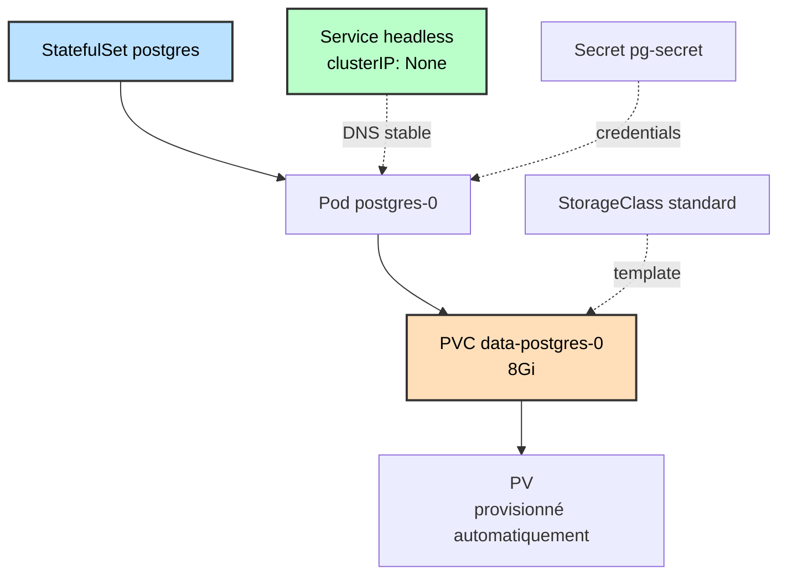

# TP S5 — Persistance & Workloads avec état

Déploiement PostgreSQL avec StatefulSet, provisionnement dynamique de volumes (PVC), et stratégie de backup/restore.

## Description

Mise en œuvre de :
- StatefulSet pour applications avec état
- Provisionnement dynamique de volumes (PV/PVC/StorageClass)
- Service headless pour identité réseau stable
- Backup et restore PostgreSQL (pg_dumpall)

## Architecture



Voir [RUNBOOK.md](RUNBOOK.md) pour la documentation technique détaillée.

## Prérequis

- Cluster Kubernetes avec StorageClass disponible
- kubectl
- Namespace `workshop`

## Déploiement rapide

```bash
./scripts/deploy-postgres.sh
```

Le script installe PostgreSQL avec volume persistant dynamique.

## Déploiement manuel

```bash
kubectl apply -f manifests/postgres/postgres-secret.yaml
kubectl apply -f manifests/postgres/postgres-service.yaml
kubectl apply -f manifests/postgres/postgres-statefulset.yaml
kubectl wait --for=condition=ready pod -l app=postgres -n workshop --timeout=120s
```

## Accès

```bash
POD=$(kubectl -n workshop get po -l app=postgres -o jsonpath='{.items[0].metadata.name}')
kubectl exec -it $POD -n workshop -- psql -U postgres
```

## Opérations

### Backup

```bash
./scripts/backup.sh
```

Sauvegarde dans `./backups/postgres-backup-YYYY-MM-DD_HH-MM-SS.sql.gz`

### Restore

```bash
./scripts/restore.sh ./backups/postgres-backup-2024-11-04_10-30-00.sql.gz
```

### Test de persistance

```bash
./scripts/test-postgres.sh
```

## Structure

### Manifests

- `manifests/postgres/postgres-secret.yaml` - Credentials PostgreSQL
- `manifests/postgres/postgres-service.yaml` - Service headless (clusterIP: None)
- `manifests/postgres/postgres-statefulset.yaml` - StatefulSet avec volumeClaimTemplates

### Scripts

- `scripts/deploy-postgres.sh` - Déploiement automatique
- `scripts/backup.sh` - Backup via pg_dumpall
- `scripts/restore.sh` - Restore depuis backup
- `scripts/test-postgres.sh` - Tests de persistance

### Documentation

- `docs/RUNBOOK.md` - Procédures techniques complètes
- `docs/INSTALL.md` - Guide d'installation S4
- `docs/ARCHITECTURE.md` - Architecture générale

Documentation dans [docs/](../docs/)

## Concepts clés

### StatefulSet vs Deployment

| Aspect | StatefulSet | Deployment |
|--------|-------------|------------|
| Identité pods | Stable (postgres-0) | Aléatoire |
| DNS | Par pod | Service uniquement |
| Volumes | PVC dédié par pod | Partagé ou aucun |
| Ordre démarrage | Séquentiel | Parallèle |

### Provisionnement dynamique

1. StorageClass définit le template de provisionnement
2. PVC demande un volume (via volumeClaimTemplates)
3. Kubernetes crée automatiquement le PV
4. Association PVC ↔ PV automatique

### Service Headless

```yaml
clusterIP: None
```

Crée DNS stable : `postgres-0.postgres.workshop.svc.cluster.local`

## Vérifications

```bash
# État des ressources
kubectl get statefulset,pod,svc,pvc,pv -n workshop -l app=postgres

# Connexion PostgreSQL
kubectl exec postgres-0 -n workshop -- psql -U postgres -c '\l'

# Espace disque
kubectl exec postgres-0 -n workshop -- df -h /var/lib/postgresql/data
```

## Nettoyage

```bash
# Supprimer PostgreSQL (conserve le PVC)
kubectl delete statefulset postgres -n workshop
kubectl delete service postgres -n workshop

# Supprimer le PVC (perte de données)
kubectl delete pvc data-postgres-0 -n workshop
```

## Livrables

- Manifests StatefulSet PostgreSQL avec PVC dynamique
- Service headless configuré
- Runbook backup/restore opérationnel
- Scripts d'automatisation
- Documentation technique

## Évaluation (10 pts)

- StatefulSet + PVC : 5 pts
- Backup : 3 pts
- Restore : 1 pt
- Documentation : 1 pt
